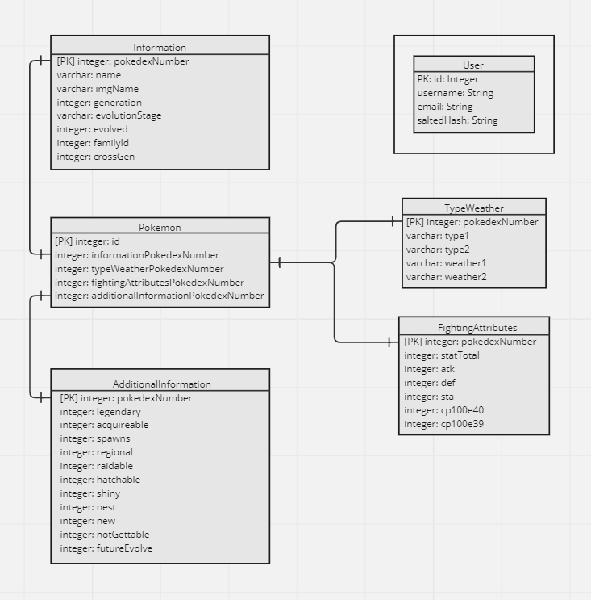

# Teste Dinheirow - Engenheiro de Software
- - -
## Implementação

- Para a criação da API foi utilizado o framework Express.js;
- Para facilitar a comunicação com o banco de dados foi utilizado o TypeORM;
- Banco de Dados: PostgreSQL;
- Para assegurar a segurança da API, todas as rotas de informações requerem authenticação por JWT;
- Para regular a quantidade de acessos, foi utilizado um Rate Limiter para 100 requisições por IP a cada 15 minutos;
- A Aplicação, o Banco de Dados e o PgAdmin4 rodam dentro de containares Docker;
- Para ver rotas e schemas, utilize o swagger em "localhost:3001/docs".
- - -
## Design

A aplicação foi projetada em uma estrutura que evita o acoplamento com as tecnologias utilizadas,
sendo essa estrutura de pastas feita da seguinte forma:

- *config*: Configurações de bibliotecas externas, neste caso o JWT;
- *modules*: Envolve os componentes macroscópicos da aplicação, Pokemon e Users;
- *shared*: Código de uso geral, compartilhado com mais de um módulo da aplicação;
- *domain*: Camada onde estão todas as regras de negócio e os protocolos que definem a estrutura necessária para seguir
o que foi definido pelo cliente;
- *infra*: Camada que guarda tudo aquilo que é relacionado à infraestrutura;
- *useCases*: Ficam dentro de cada módulo, abrangendo os casos de uso da aplicação;

Os testes da aplicação abrangem todos os useCases e foram implementados utilizando o Jest e foram projetados na
seguinte estrutura:

- *specs*: Guardam os *scenarios* da aplicação, onde os testes são definidos de maneira abstrata se aproximando ao
máximo da linguagem do domínio;
- *executers*: Traduzem a linguagem abstrata dos *specs* e executa os testes utilizando um repositório fake;
- *FakeRepository*: um repositório fake que simula um repositório real, permitindo que os testes de useCases sejam
testados de forma mais isolada;
- --

## Entity Relation Diagram

- - -
## Rodando a aplicação

Como a aplicação está no docker-compose, basta configurar as variáveis de ambiente
seguindo o modelo do arquivo ".env.example" e rodar o docker compose.

